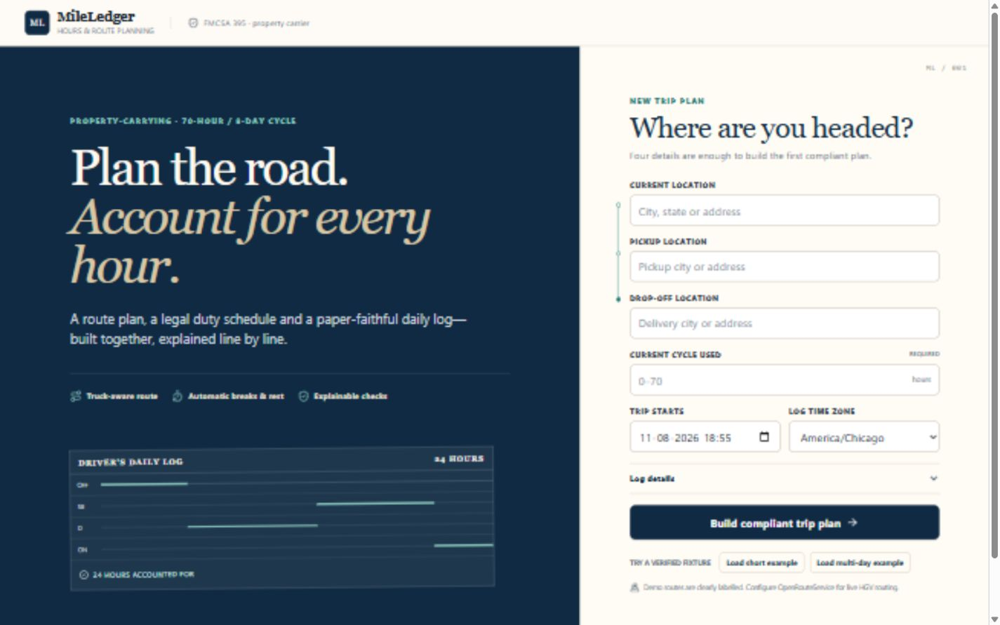
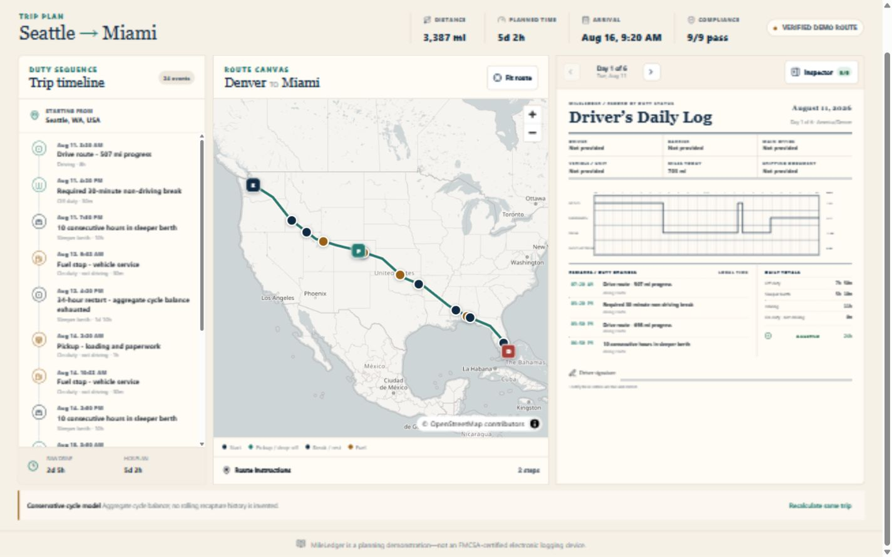
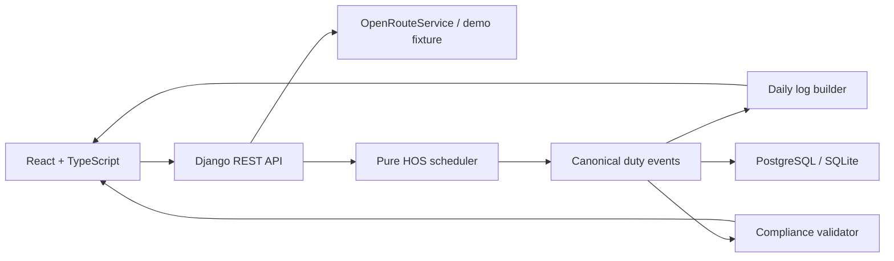

# MileLedger

**Plan the road. Account for every hour.**

MileLedger is a full-stack property-carrier trip planner that turns a route into one canonical, deterministic duty schedule. The same events drive the map, timeline, paper-faithful daily logs, and rule-by-rule compliance inspector.





## What it does

- Accepts current location, pickup, drop-off, and current 70-hour/8-day cycle usage.
- Requests live `driving-hgv` routes through a server-side OpenRouteService adapter.
- Includes clearly labelled, deterministic short and multi-day fixtures for tests and portfolio review.
- Schedules pickup/drop-off work, fuel, qualifying 30-minute breaks, 10-hour sleeper periods, and conservative 34-hour restarts.
- Generates one midnight-to-midnight daily log per local calendar day; every log totals exactly 1,440 minutes.
- Draws a keyboard-accessible SVG duty-status graph from the canonical events.
- Synchronizes selected events across timeline, map, log remarks, graph segments, and compliance findings.
- Supports browser print / “Save as PDF,” one US Letter log per page.
- Restores persisted plans from the `?trip=<uuid>` URL.
- Adapts from a three-pane desktop studio to dedicated mobile workspace tabs.

## Architecture



The backend owns routing, integer-minute scheduling, metre-based route progress, timezone splitting, persistence, and compliance. The frontend is a typed projection of the returned plan and never recalculates legal limits. See [Architecture](docs/ARCHITECTURE.md), [API](docs/API.md), and [HOS rules](docs/HOS_RULES_AND_ASSUMPTIONS.md).

## Technology choices

- Backend: Python 3.13, Django 5.2, Django REST Framework, PostgreSQL/SQLite, Gunicorn, WhiteNoise.
- Frontend: React 19, strict TypeScript, Vite 7, MapLibre GL JS, hand-built SVG ELD graph.
- Quality: Django TestCase, Ruff, Vitest, Testing Library, Playwright, GitHub Actions.
- Routing: OpenRouteService geocoding and `driving-hgv`, proxied and cached by Django.

## Local setup

Prerequisites: Python 3.12+, Node 22+, and pnpm 10+.

```bash
cd backend
python -m venv .venv
# Windows: .venv\Scripts\activate
# macOS/Linux: source .venv/bin/activate
python -m pip install -r requirements.txt
python manage.py migrate
python manage.py runserver 127.0.0.1:8000
```

In a second terminal:

```bash
cd frontend
pnpm install --frozen-lockfile
pnpm dev
```

On Windows installations where Corepack cannot write to `C:\Program Files\nodejs`, use the no-admin equivalent:

```powershell
npx --yes pnpm@10 install --frozen-lockfile
npm run dev
```

Open `http://127.0.0.1:5173`. Demo fixtures work with no credentials. To plan arbitrary live routes, copy `.env.example`, set `OPENROUTESERVICE_API_KEY`, and load the variables before starting Django.

## Environment variables

| Variable | Purpose |
|---|---|
| `DJANGO_SECRET_KEY` | Required secret in production. |
| `DJANGO_DEBUG` | `true` locally; must be `false` in production. |
| `DJANGO_ALLOWED_HOSTS` | Comma-separated backend hosts. |
| `DATABASE_URL` | SQLite locally or PostgreSQL in production. |
| `CORS_ALLOWED_ORIGINS` | Comma-separated frontend origins. |
| `CSRF_TRUSTED_ORIGINS` | Trusted HTTPS frontend origins. |
| `OPENROUTESERVICE_API_KEY` | Server-only live routing credential. |
| `ROUTING_TIMEOUT_SECONDS` | Provider timeout; default `15`. |
| `DEMO_MODE` | Allows only the checked-in labelled fixtures when `true`. |
| `API_THROTTLE_RATE` | Anonymous API throttle; default `60/minute`. |
| `VITE_API_BASE_URL` | Production backend origin used by the browser. |

## Verification

```bash
cd backend
python -m ruff format --check .
python -m ruff check .
python manage.py test

cd ../frontend
pnpm lint
pnpm typecheck
pnpm test
pnpm build
pnpm e2e
```

The E2E command starts/reuses both local services and checks desktop plus mobile flows. The CI workflow runs backend, frontend, and Chromium E2E gates. Stable contributor commands are in [AGENTS.md](AGENTS.md).

## HOS model

MileLedger implements the assessment’s property-carrying model: 11 driving hours after 10 consecutive hours off, a 14-hour driving window, a qualifying 30-minute non-driving break before driving beyond 8 cumulative hours, and a 70-hour/8-day cycle. Driving plus on-duty/not-driving consume cycle time. Pickup and drop-off are exactly 60 on-duty minutes each. Fuel is planned around 900 miles with a 30-minute service duration.

Only aggregate current cycle usage is supplied, so MileLedger deliberately does not invent rolling eight-day recapture history. It inserts a 34-hour restart when the known balance is insufficient. Split sleeper, adverse-driving, short-haul, personal-conveyance, team-driving, and passenger-carrier rules are outside this assessment.

## Deployment

The frontend includes Vercel SPA routing; the backend includes a production Dockerfile, Render blueprint, PostgreSQL support, Gunicorn, static handling, secure settings, health check, migrations, CORS, and throttling. Follow [Deployment](docs/DEPLOYMENT.md). Public deployment still requires access to the owner’s Vercel, Render, OpenRouteService, and optional GitHub accounts.

## Known limitations

- Live geocoding/routing requires an OpenRouteService key and follows that provider’s availability and free-tier limits.
- Demo mode intentionally recognizes only the two checked-in fixture routes.
- Planned route stops retain route coordinates when reverse geocoding is unavailable; the system never invents a city label.
- The cycle model is conservative because the assessment does not provide the prior eight individual duty days.
- Browser print is the supported PDF path; this is not a signed or certified electronic record.
- SQLite and in-memory routing cache are local defaults; production uses PostgreSQL and can replace the cache backend.

## Source basis and disclaimer

The domain model follows the supplied assessment, the April 2022 FMCSA driver guide, the official FMCSA property-carrier summary, and the supplied paper-log walkthrough reference. Detailed interpretations are recorded in [HOS rules and assumptions](docs/HOS_RULES_AND_ASSUMPTIONS.md).

**MileLedger is a trip-planning demonstration and is not an FMCSA-certified electronic logging device or a substitute for official compliance review.**
